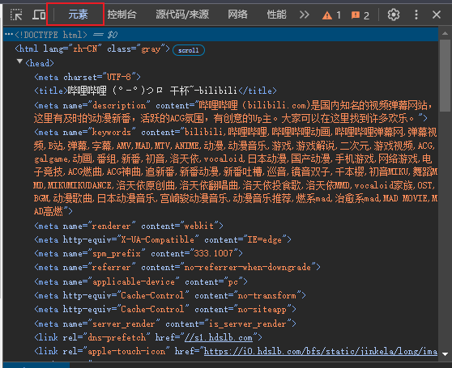

# 命令行浏览器

> 本题目拷贝自 [git.nju.edu.cn 命令行浏览器](https://git.nju.edu.cn/huorunz/browserinterminal/-/blob/main/README.md)


---

## 题目描述

小 A 在 CPL 课上接触到了命令行，发现命令行对工作效率的提升有如神助，于是便下定决心成为命令行高手。小 A 打开命令行，想要百度一下如何成为[命令行高手](https://zhuanlan.zhihu.com/p/71776854)。尴尬的是，小 A 发现他甚至无法通过命令行来访问网页。于是小 A 找到了你，希望你为他写一个命令行可用的浏览器。

为了简化题目，尽可能减少大家的工作量，贴心的小 A 已经把浏览器网络相关的部分写好了，我们只需要实现对**网页的解析与渲染**。即：输入并解析网页源代码，并输出网页的渲染结果。

我们要做的所有工作蕴含在这**三个问题**的答案里：解析什么？怎么解析？怎么渲染？

### 解析什么

解析 HTML —— HyperText Markup Language (超文本标记语言)。

> 作为[前端三件套](https://www.w3cschool.cn/article/35382959.html)之一，HTML 是今后接触软件开发绕不开的东西(甚至你现在正在看的这篇文档，从某种程度上来说也是 HTML)。学有余力的同学可以看[HTML（超文本标记语言） | MDN](https://developer.mozilla.org/zh-CN/docs/Web/HTML)，以及同站的 CSS 和 JS 的介绍。

网页并不是像 PPT 那样，把需要的元素拖到对应位置上就万事大吉的，而是通过一种叫 HTML 的语言来组织，以实现丰富的功能。

你可以随便打开一个网页，按下 `F12` 并切换到 `元素` 一栏，来查看当前网页的 HTML 源代码。



你能访问到的网站的 HTML 都相当复杂。我们从基础开始。

### 如何解析

> 保证所有样例遵循下面的解析规则

#### 单个元素的解析

从最朴素的角度思考，我们要用一串代码来表示网页中的一个元素内容，比如一个字符串，应该怎么实现？

当然是直接用这个字符串表示他自己：

```text
Man, what can I say
```

但是我们还得考虑到，网页中的一串字符，应该还要拥有一系列**属性**，包括字号、字体、加粗、斜体等等。直接把属性写到代码里的话，我们如何区分属性和内容呢？

在 HTML 里是这样规定的：


- 将要渲染的**内容(content)**用**标签(tag)**包裹起来，内容前的是**开始标签(opening tag)**，后面的是**结束标签(closing tag)**
- 标签是用 `<` 和 `>` 包裹的字符串
    - 标签包含**元素名**。元素名指示了当前这一整个元素是哪一类内容(例子中元素名为 `p`)
    - 开始标签中，还包含了**属性(attribute)**
    - 结束标签中，在元素名前面有一个正斜杠 `/`
- 属性由**属性名**、等于号和**属性值**构成。特殊地，某些属性可以只由属性名构成，详见后面的例子
    - 开始标签中可以有多个属性，每个属性间由一个或多个空格分开
    - 属性值用双引号包裹
- 这一整个东西表示一个**元素(element)**

所以，上图中的例子，表示有一个元素 `p`，内容是 `Man, what can I say`，拥有属性 `href`，值是 `oj.cpl.icu`。

再来几个例子：

```html
<h1 em justify="center">Manba out</h1>
```

表示一个 `h1` 元素，内容是 `Manba out`，拥有属性 `em` 和 `justify`，后者值为 `center`。

```html
</img>
```

表示一个 `img` 元素，没有内容(为什么会存在没有内容的元素？这里先按下不表，详见渲染部分)，拥有属性 `src`，值为一个网页链接。

#### 嵌套元素的解析

看完上一节内容，相信你可以十分甚至九分轻松地解析出单个 html 元素了。但是在 html 中，还有一个重要的特性需要我们去了解：嵌套元素。

简而言之，嵌套元素允许我们将一个或多个元素作为另外一个元素的内容。如下：

```html
<div>
    <h>Man, </h>
    <p>What can I say</p>
    <p>Manba out</p>
</div>
```

这样做能够显式地表达元素间的*父子关系*。子元素可以**继承**父元素的位置以及某些属性。

> 子元素能从父元素继承大部分属性，但有些属性**无法继承**。后面会介绍。
>
> 子元素从父元素继承到的属性可能对渲染没有任何作用。后面会介绍对于每一种元素，接受哪些属性是有效的。

有了嵌套，我们可以设计出一些专门用于嵌套的元素，这些元素并不直接渲染内容，而是为嵌在其内部的元素提供属性。在我们的实现中，**只有** `div` 这一种元素能支持嵌套。

```html
<div em>
    <p>All</p>
    <p>Good</p>
</div>
```

上例就是用一个含有加粗属性的 div 元素包裹两个 p 元素，以实现这两个 p 元素中内容的加粗。

值得注意的是，在**任何地方**的**换行**对渲染是没有任何作用的，换行仅仅是为了 HTML 代码的美观。

### 如何渲染

在解析了 HTML 之后，你需要将其中的元素按规则渲染到一个宽为 50，高为 10 的字符命令行界面上。为了简化，你只需要渲染到一个 char\[10]\[50] 的二维字符数组中，并打印出来即可。

每一种元素有其独特的渲染方式，并且会根据属性来进行一些调整。

> 本项目意在帮助大家建立对 HTML 的认识，所以并不会让大家真的去解析正版 HTML。下面的内容都是助教的简化魔改版。

我们分别介绍*元素*、*布局*以及*属性*。此三者之间互有关联，有理解不了的很正常，暂时跳过即可。建议反复阅读。

#### 元素

介绍元素时，其中的*属性*表示仅有列出的属性对这个元素有**渲染上的作用**。其他的属性——如无特殊说明——对元素没有作用。

列出的属性，如果是*无值*的，或者*必选*的，会标出。否则为*有值*且*可选*属性。

在嵌套结构中无法被继承的属性会标出*不可继承*。

##### 标题(Heading)

- 元素名：`h`
- 属性：
    - `color`：文本颜色。接受颜色字符串。为 `red`, `blue`, `green`中的一个。文本以命令行中的默认颜色输出时不需要指定这个属性。
    - `em`：emphasis，文本加粗。<u>无值</u>。
    - `i`：italic，文本斜体。<u>无值</u>。
    - `u`: underline, 文本下划线。<u>无值</u>。

以全**大写字符**的形式，渲染内容中的文本。

示例：

```html
<h em color="red">God, this project seems so hard!</h>
```


##### 段落(Paragraph)

- 元素名：`p`
- 属性：
    - `color`, `em`, `i`, `u`

渲染内容中的文本。

示例：

```html
<p i u>Maybe it's not that hard.</p>
```


##### 图片(IMaGe)

- 元素名：`img`
- 属性：
    - `src`：图片内容。接受一个可见字符组成的字符串，表示图片在命令行中要显示什么字符。<u>必选</u>。不可继承。
    - `width`：图片宽度。接受一个整数，表示图片一行有多少个字符。保证能整除 src 中字符串的长度。<u>必选</u>。不可继承。

渲染 src 中的图片。

示例：

```html
</img>
```


##### 容器(DIVision)

- 元素名：`div`
- 属性：
    - `w`：容器宽度。接受一个正整数，表示容器的宽度，单位为字符。<u>不可继承</u>。
    - `h`：容器高度。接受一个正整数，表示容器的高度，单位为字符。<u>不可继承</u>。
    - `direction`：容器内元素排列方向。接受一个字符串，为 `row` 和 `column` 中的一个，表示容器中元素按*行*布局还是按*列*布局(在后面的布局中会详细说明，不理解可以暂时放放)。如果没有指定，则默认为按行布局。<u>不可继承</u>。
    - `align-items`：容器内元素垂直排布方式。接受一个字符串，为 `start`, `center`, `end`, `space-evenly` 中的一个。详见布局。<u>不可继承</u>。
    - `justify-content`：容器内元素水平排布方式。接受一个字符串，为 `start`, `center`, `end`, `space-evenly` 中的一个。详见布局。<u>不可继承</u>。
    - 之前提及的所有属性。对容器的布局不产生作用，但是会向下继承。
- 注意：
    - 只有容器能拥有子元素


示例(注意渲染结果中的空格)：

```html
<div 
     w="10" 
     h="5" 
     direction="row" 
     align-items="center" 
     justify-content="end"
     i u
     >
        <p>Upper</p>
        <p>Middle</p>
        <p>Lower</p>
</div>
```


#### 属性

属性的继承遵循以下规则：

1. *子元素*继承**所有**来自*父元素*的<u>可继承</u>的属性

2. 从*父元素*继承的属性与*子元素*自己所拥有的属性发生*冲突*时，以*子元素*的属性为准

    - ```html
        <div color="white">
            <p color="red">I'm Red</p>
        </div>
        ```

    - 上例中，`color` 属性以 p 元素的为准

我们给出一个尽可能全的例子，方便大家理解与实现：

```html
<div color="white">
    <div color="red">
        <p>A</p>
        <p color="green">B</p>
    </div>
    <div em>
        <p color="red">C</p>
        <p>D</p>
    </div>
    <p i>E</p>
</div>
```

这之中，各个元素所拥有的属性如下图：


其中，**绿色**的属性是这个元素**自己声明**的属性。**紫色**属性是从某个父元素**继承得来**的属性。

> 这里的表示用到了[树的数据结构](https://oi-wiki.org/graph/tree-basic/)，但大家不用担心，具体实现可以不用任何树的知识，课上和平时作业的知识足够了

#### 布局

##### 位置

只有两点需要强调：

1. HTML 代码中的元素，从网页的左上角开始依次渲染
2. div 中的子元素，从 div 的左上角开始依次渲染

例子：

```html
<div w="10" h="3">						// div 1
    <div w="5" h="2"></div>				// div 2
</div>
<div w="10" h="3">						// div 3
	<div w="5" h="2"></div>				// div 4
</div>					
```


##### 元素尺寸

元素的尺寸由*宽*和*高*构成，单位均为字符。

- `p` 和 `h` 元素的宽度为其内容的字符数，高度为 1
- `img` 元素的宽度由 `width` 指定，高度为 `src` 中字符串长度除以 `width`
- `div` 元素的尺寸由 `w` 和 `h` 指定，前者为宽度，后者为高度
    - 如果其中一个未指定，则由 div 的子元素决定。详情看下面的行列布局第二点

##### 行列布局

行列布局决定了 div 元素内，子元素沿什么方向排列。

**按行布局**：并列的元素，每个元素是“一行”，即从上往下排元素。见下图中左侧。

**按列布局**：并列的元素，每个元素是“一列”，即从左往右排元素。见下图中右侧。


行列布局有以下要注意的点

1. 当没有指定行列布局时，默认**按行布局**
    - 无论是对某个 div 还是对整个页面，只要没有要求按列布局，那就是按行布局
2. 对于一个 div 而言，如果没有指定其 `w` 或 `h` 属性：
    - 如果是按行布局，div 的宽度是和子元素中最宽的那个相同；高度是所以子元素高度之和
    - 如果是按列布局，div 的宽度是所有子元素宽度之和；高度和子元素最高的相同
    - 如果没有子元素，那 `w` 或 `h` 就是 0。这个 `div` 不需要被渲染

##### 对齐

水平和垂直的对齐是分别通过 `justify-content` 和 `align-items` 实现的。

二者基本相似，所以下面以**水平对齐**为例，垂直对齐请自行推导。

对齐的本质是如何分配*当前容器的宽度*减去*子元素宽度和*，所剩的这部分宽度。或者称之为*空白宽度*。我们记为$w$。

- `start`：空白宽度全部放容器最右边。
- `end`：空白宽度全部放容器最左边。


- `center`：空白宽度分成两等份，一份左边一份右边。子元素在中间。
    - 由于 $w$ 可能无法被 2 整除，所以令左空白为 $w/2$，右空白为 $w-w/2$


- `space-evenly`：空白宽度分成 $n+1$ 等份，其中 $n$ 是行方向上元素的数量
    - 同样地，$w$ 可能无法被 $n+1$ 整除，所以令**最后一个空白**为 $w-w/(n+1)*n$，其他空白为$w/(n+1)$
    - 你可以注意到，space-evenly 对 $n=1$ 的效果和 center 是一样的


如果没有指定对齐方式，两者都默认按 `start` 对待。

#### 命令行样式

> 要在命令行中输出有样式的文本（如加粗、下划线、字体颜色），你需要并且**必须**使用下面的方法。不然拿不到分。

如果一段文本拥有样式相关的属性，要对一段文本加上样式，在这道题中你需要做：

- 在即将输出这段文本之前，输出一个或者多个*转义码*，之间没有空格
- 在输出这段文本之后，**马上**输出**一个** *样式重置转义码*，`\033[0m`

**转义码规定**如下：

- 颜色(color)

    - red: `\033[31m`

    - blue: `\033[34m`

    - green: `\033[32m`

- 加粗(em): `\033[1m`

举例：

```html
<p em>Bold Text</p>
```

```
\033[1mBold Text\033[0m
```

- 斜体(i): `\033[3m`
- 下划线(u): `\033[4m`
- 样式重置: `\033[0m`

对于一段文本拥有多个样式的，文本前的转义码输出**必须**按照上面**转义码规定**中的顺序输出转义码，比如：

```html
<p u color="red" i em>multiple attr</p>
```

```
\033[31m\033[1m\033[3m\033[4mmultiple attr\033[0m
```

你可能会对这部分有疑问，为什么

1. 在本地命令行中有样式，但在 oj 上就没样式，并且这些转义码被原封不动地输出来了？
2. 我到底应该输出什么？

第一个疑问，这些转义码其实本名是 [ANSI 转义码](https://zhuanlan.zhihu.com/p/570148970)。在本地命令行中，命令行会自动识别你输出的这些转义码，并转换成样式。在 oj 上，oj 返回的输出就是一个纯文本，你塞什么字符它就显示什么字符（虽然很多不可见字
符无法正常渲染）。

第二个疑问，你输出的内容就是**包含转义码的字节流**。样例中花里胡哨的图片是给你看效果的，你的目标输出见仓库的 `cases` 目
录下的一堆 `.out` 文件。

这么说还是会比较绕，我直接用上面那个例子：

输入：

```html
<p u color="red" i em>multiple attr</p>
```

你的输出应该与下面程序的输出完全相同（忽略行末空格和换行，以及末尾缺少的空行）

```c
#include<stdio.h>
int main() {
        printf("\033[31m\033[1m\033[3m\033[4mmultiple attr\033[0m");
    return 0;
}
```

> clion 中可能输出不了花花绿绿的样式，你需要在运行配置中打开“在输出中模拟终端”
>
> 

## 实现提示

### 输入

- 输入的 HTML 源代码中，换行(`\n`)、制表符(`\t`)是没有任何作用的。可以随意丢掉
- 建议使用 `getchar()` 读入
- 尽量使输入具有[鲁棒性](https://zh.wikipedia.org/zh-hans/%E9%B2%81%E6%A3%92%E6%80%A7)。具体来说，请不要对输入的格式做过多的假设，比如“标签名和属性之间只有一个空格”。但是测试数据会尽可能保证规范，不出现很难想到、难处理的情况

#### 确定解析策略

HTML 源码是嵌套风格的语言，我们这里的 div 元素实现了类似的嵌套风格。说到嵌套风格，你有没有想起来[括号序列](https://oj.cpl.icu/contest/15/problem/88)？我们使用类似的策略来**解析** HTML 源码序列。

你可以将开始标签看作`(`，内容是括号中的内容，结束标签看作`)`。

即：在扫描的时候用**栈**来存储当前扫描的信息。遇到开始标签，就入栈；遇到结束标签就出栈。

简而言之，遇到了*开始标签*，说明我们当前在扫描这个元素。遇到*结束标签*，这个元素扫描结束。

在任意一个时刻，有如下几个很重要的性质：

- 你知道你正在和哪个元素打交道：（栈顶）最近一次扫描到的开始标签
- 你知道当前元素的所有父元素：（除栈顶外所有元素）遇到了开始标签但未遇到结束标签的元素，都是当前元素的父元素（除了它自己）。
- 你知道当前元素的直接父元素：（栈顶下的第一个元素）离当前元素最近的那个，遇到开始标签但没结束的元素。


在上图中，栈大致长这样：

```
|       |
|  <p>  | <- stack top element
|-------|
| <div> |
|_______|
```

除此之外，慎用 C 语言自带的字符串处理函数来解析，比如 `strtok`、`strchr`，除非你对这些函数特别熟悉。否则，建议逐字符地扫描解析输入的 html 源代码。当然这只是个小小的建议，到底用哪种你说了算🫡。

#### 解析目标

解析时，助教建议得到并保存每个元素的如下信息：

- 元素名
- 在开始标签中声明的属性
- 内容（如果有的话）
- 父元素的指针
- 元素的尺寸

前三个好办，就是字符串处理嘛。第四个也可以轻松知道。第五个怎么办呢？

对于 p、h 和 img 元素，尺寸很好办。对于 div 元素，如果其 w 或 h 没有指定，我们怎么得到它的尺寸呢？

参考[行列布局](#行列布局)，div 没有指定 w 或 h 时，需要*子元素宽/高之和*、*子元素宽/高最大值*。

那我们现在的思路可以往前走一步了：我们只需要维护每个元素的孩子们的宽高的和以及最大值。

问题来了，我们在上面的解析策略中，我们怎么知道子元素的宽高信息呢？

我们反过来处理，既然没法预知子元素，但我们可以反过来**更新父元素**的，即更新父元素的孩子们的宽高信息。因为当前元素的父元素是已知的（看解析策略）。

在什么时候更新父元素呢？当然是我们已经知道当前元素的尺寸之后，即当前元素退栈（遇到结束标签）的时候。

### 渲染与输出

我们可以用一个 10*50 的二维数组存网页的画布，初始化成空格。至于多出来的转义符，可以再开一个或多个数组存放。

对于真正的渲染，有两种方法供你参考：递归与非递归

#### 非递归

不用递归实现的话，方法还是很多的。鉴于这道题的数据规模很小，你可以开辟大量的空间来存放你感兴趣的数据。

渲染过程中，最难确定的是元素的绝对位置。元素的绝对位置是由父元素的绝对位置、父元素布局以及元素在父元素中是第几个子元素决定的。

一种可行的思路是，仿照上一部解析中的方法，再扫描一遍源码，并用栈来维护父子信息。

扫到当前元素的开始标签时，将当前元素入栈，然后计算得到当前元素的绝对位置，步骤如下：

- 获取父元素绝对位置（需要开个新数组，或者结构体开个新成员存下来）

> 为什么一定能获取到父元素的绝对位置？因为我们在一扫到开始标签时，就能计算得到这个元素的绝对位置（即我们当前正在干的工作）。并且，子元素被扫到的时候，父元素一定早就被扫到了，所以父元素的绝对位置早就计算出来了。

- 根据父元素的布局属性、以及兄弟元素的尺寸，计算出当前元素相对于父元素的位置

- 绝对位置＋相对位置，当前元素的绝对位置就有了

#### 递归

递归的方法本质上是对**树**的递归。没学过？其实并不妨碍阅读。你只需要在心中有一个元素的一对多的父子关系就行了。

直接给出递归函数的原型。含义为在画布的 `row` 行 `col` 列处渲染 `element` 指针指向的元素。

```c
void render(Element *element, int row, int col);
```

递归和数学归纳法类似，要从基础步骤开始。

**递归边界**

<u>element 为非 div 时，直接渲染元素并返回</u>

很简单，element 指向非 div 时，我们直接在画布对应位置把元素的内容贴上去就行了。不要忘了同时贴上转义码。

**递归步骤**

当 element 为 div 时，我们要考虑通过递归去渲染这个 div 的子元素。

> 这里一个小 tip 是，可以直接将所有元素扫一遍，只要父亲为这个 div，这个扫到的元素就是子元素。从而得到所有子元素。这样能避免存儿子指针，并且所有元素本身是有序排列的，前面的子元素一定能先于后面的子元素被扫到。

对子元素做递归时，记得计算子元素的新的 row 和 col。你问我怎么计算？你知道了当前 div 的 row 和 col（参数里面），还知道 div 的布局信息，还知道子元素的大小，这三者结合起来是完全能确定子元素的位置的。

> 最后还有一个小 tip：你可以用一个 \<div w="50" h="10"/> 来作为所有最外层元素的父亲，对这个元素调用 render，row 和 col 都为 0，即可直接递归渲染所有元素

### 数据结构

存储元素的时候尽可能使用结构体。

也许[C enum(枚举)](https://www.runoob.com/cprogramming/c-enum.html)可以帮你方便地表示元素类型、属性。使用枚举能极大地减少代码量与代码冗余。

## 测试数据

### 数据约定

> 你可以不用担心一些极端的数据，当你对测试数据有疑问的时候，可以参考样例是怎样的。保证实际测试数据和样例的情况**基本相同**。只要你的代码里没有一些奇怪的行为，能过样例 == 能过测试点。

对于所有测试点，保证：

- 严格控制元素格式

    - ```html
        <p i u color="wow">Nihao</p>
        ```

    - 开始标签中，元素名与属性一定会用空格分隔（不一定只有一个！）。当然也会存在一些制表符和换行，建议输入的时候就忽略。

    - 内容中可能有多个空格，你需要渲染这些空格。下划线对空格有效果。加粗、颜色、斜体对空格没用。

    - 除了开始标签和结束标签，其他地方不会出现 `<` 和 `>`。同理，只有属性值处会出现 `"`，属性值前会出现`=`。你可以以此类推，`/` 等字符也不会乱出现。

- 对于长度的约定

    - HTML 源代码长度不超过 $10^4$ 个字符
    - 总的元素个数不超过 $100$
    - 每个开始标签中声明的属性数不超过 $10$ 个
    - 元素的内容长度不小于 $1$ 个字符，不超过 $50$ 个字符，所以 p 和 h 元素不会撑爆一行（转义码是不计在内的）
    - 属性值的长度不超过 $500$。

- 所有元素的高和宽不超过网页的高和宽。如果有父元素且父元素指定了高和宽，也不会超过。总之，你**不需要考虑**任何子元素把父元素撑爆的情况。

- 题中只涉及 `char` 能表示的字符，不用考虑宽字符

### Special judge 提示

本题开启了 Special judge，以便大家查看自己哪些点出错。

当你在某些数据点上有错误时，提交信息中的评测信息会提示你哪些点出错，并附上这个数据点的一些特征。包括拥有哪些标签、哪些属性。

由于助教使用了一些奇技淫巧来实现评测信息的输出，样例输出中不得不在第一行加上样例的名称。大家请忽略样例输出的第一行，以其余内容为准。不过这并不影响样例的评测，样例出错也会显示到评测信息中。

错误数据点在评测信息里会乱序输出，这是评测机并发评测数据点导致的，目前没有较好的解决方法。

### 数据分布

为如下分布：

- phTest (4 cases, 20pts): 只包含 `p` 和 `h` 元素
- phimgTest (8 cases, 40pts): 只包含 `p`, `h` 和 `img` 元素
- divTest (4 cases, 20pts): 包含全部元素。保证 `div` 元素只含 `w` 和 `h` 属性
- layoutTest (4 cases, 20pts): 包含全部元素与属性

## 输入格式

 输入一个不知道多少行的魔改版 HTML 源代码。代码总长度小于 $10^4$。

## 输出格式

在 OJ（非终端） 中，输出一个 10 行，大于等于 50 列的原始结果，包含了转义码。

在命令行终端中，输出一个 10 * 50 可见字符的网页渲染结果。

## 测试样例

说明：输出必须是 10 * 50 的大小，空白用空格补全。

仓库中 `cases` 目录下有样例的输入和输出源文件，你可以使用输入重定向来读入文件。

输出转义符以输出源文件中的为准。

### 样例一

```html
<p>HELLO</p>
```


### 样例二

```html
<h u em>Lorem ipsum</h>
<p color="green">Lorem ipsum dolor sit amet, Lorem ipsum sit amet.</p>
<p i>Ut enim ad minim veniam, quis nostrud exercition.</p>
<p u>Lit, sed do eiusmod incididunt ut labore et dole.</p>
<p em>voluptate velit esse cillum dolore eu fugiat null.</p>
```


### 样例三

```html
</img>
```


### 样例四

```html
<h em>Do not go gentle into that good night</h>
<p i>Dylan Thomas</p>
<p>Do not go gentle into that good night,</p>
<p>Old age should burn and rave at close of day;</p>
<p>Rage, rage against the dying of the light.</p>
</img>
```


### 样例五

```html
<div w="50" h="10">
    <div w="50" h="3"></div>
    <div>
        <p em color="green">        Play    15s    Hint    Pass</p>
    </div>
    </img>
</div>
```


### 样例六

```html
<div w="50" direction="column">
    <div w="5" h="1"></div>
    <h em>C-PL dotOJ</h>
    <div w="20" h="1"></div>
    <p u>Home</p>
    <div w="2" h="1"></div>
    <p u>Login</p>
</div>
<div w="50" direction="column">
    <div w="5" h="1"></div>
    <div w="20" h="9">
        <h u>Bulletins</h>
        <div>
            <p>Solution of 2nd exam</p>
            <p i>1.feishu.t1</p>
            <p i>2.feishu.t2</p>
            <p i>3.feishu.t3</p>
        </div>
        <div>
            <p>Check your score</p>
            <p i color="red">1.Check plagiarism</p>
            <p i>2.link</p>
        </div>
    </div>
    <div w="8" h="8"></div>
    <div w="15" h="8">
        <h u>Homework</h>
        <div w="15" h="3">
            <p em>2024-9-pointers</p>
            <p color="green">    Enter</p>
            <p i>  2024-12-07</p>
        </div>
        <div w="15" h="3">
            <p em> 2024-10-LList </p>
            <p color="green">    Enter</p>
            <p i>  2024-12-20</p>
        </div>
    </div>
</div>
```


### 样例七

```html
<div
     w="50"
     h="10"
     direction="row"
     justify-content="center"
     align-items="space-evenly"
     >
    <p>ELEMENT</p>
    <div
         w="20"
         direction="column"
         justify-content="start"
         >
        <p>ELEMENT</p>
        <p>ELEMENT</p>
    </div>
    <div 
         w="30"
         direction="column"
         justify-content="end"
         >
        <p>ELEMENT</p>
        <p>ELEMENT</p>
        <p>ELEMENT</p>
    </div>
    
	</img>
</div>
```


### 样例八

```html
<div w="50" h="1" direction="column" justify-content="end">
        <p em>Gmail  </p>
        <p em>Images</p>
    </div>
<div w="50" h="9" direction="row" align-items="center" justify-content="center">
    </img>
    <div w="20" h="1" direction="column" justify-content="center">
        <p>[</p>
        <p u>Q_________________</p>
        <p>]</p>
    </div>
    <div w="50" h="1" direction="column" justify-content="space-evenly">
        <p u color="blue">GOOGLE SEARCH</p>
        <p u color="red">IM FEELING LUCKY</p>
    </div>
</div>
```


